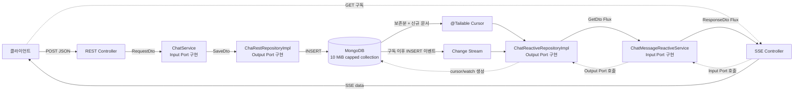
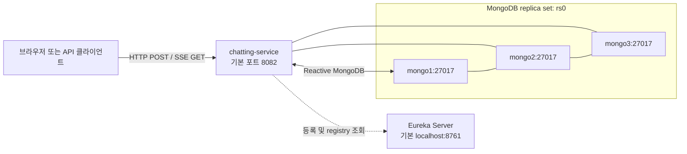
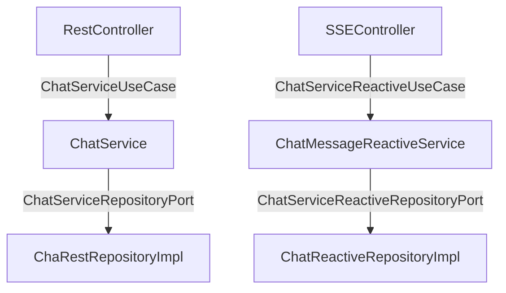
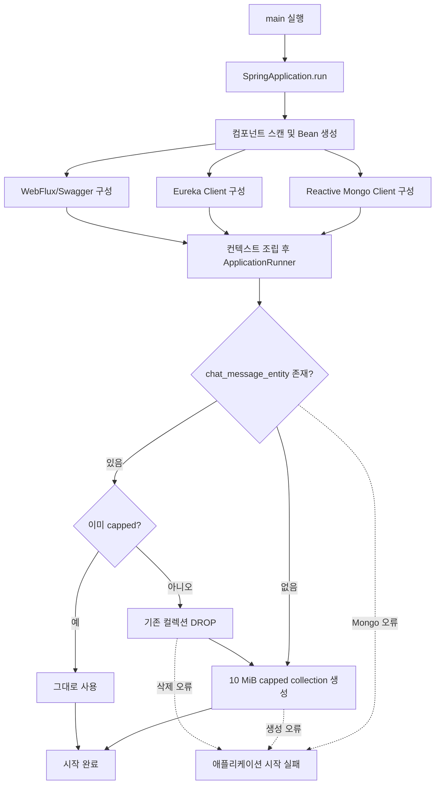
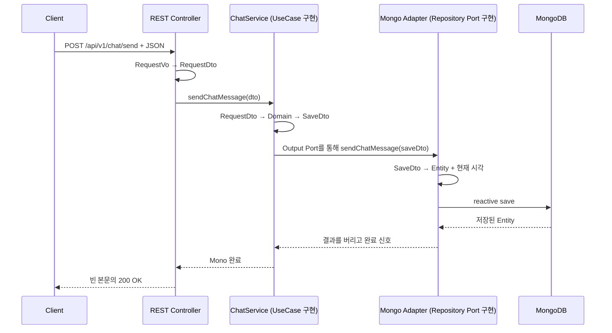

# Reactive Web MongoDB 채팅 서비스 아키텍처 분석

> 분석 기준: `main` 브랜치 `32948b6`  
> 분석일: 2026-07-28  
> 범위: `build.gradle`, 애플리케이션 설정, `src/main`, `src/test` 전체

## 빠르게 읽는 순서

처음 프로젝트를 접했다면 `1 → 3 → 6 → 7 → 11 → 16 → 20` 순서로 읽으면 전체 그림, 시작 과정, API 차이, 핵심 위험을 먼저 파악할 수 있다. 구현을 수정해야 한다면 그다음 `4`, `8~14`, `17~19`를 참고하면 된다.

- [5분 요약과 전체 구조](#1-가장-먼저-이해할-핵심)
- [디렉터리와 계층별 책임](#3-전체-디렉터리-구조)
- [시작 및 API 작동 흐름](#6-애플리케이션-시작-플로우)
- [두 실시간 방식 비교](#11-두-실시간-방식-비교)
- [결함과 운영 위험](#16-확인된-결함과-운영-위험)
- [빌드·테스트 상태와 실행 전제](#17-테스트와-빌드-상태)
- [개선 순서와 최종 평가](#19-개선-우선순위)

## 1. 가장 먼저 이해할 핵심

이 프로젝트는 **메시지를 HTTP POST로 저장하고, 서버가 메시지를 SSE(Server-Sent Events)로 계속 밀어주는 채팅 서비스**다.

일반적인 WebSocket 양방향 채팅과는 다르다.

- 보내기: `POST /api/v1/chat/send`
- 받기 1: capped collection의 Tailable Cursor를 사용하는 SSE
- 받기 2: MongoDB Change Stream을 사용하는 SSE
- 저장소: MongoDB의 `chat_message_entity` 컬렉션
- 서비스 등록: Eureka
- API 문서: Springdoc/Swagger UI

현재 실제로 연결된 기능은 `ChatMessage`뿐이다. `ChatRoom`, `Participant` 모델과 Entity는 존재하지만 Controller, Service, Repository, Mapper가 없어 아직 실행 흐름에 참여하지 않는다.



구조는 **Ports & Adapters(헥사고날 아키텍처)**의 의존 방향을 따른다. 명령 저장 경로와 스트림 조회 경로를 나눠 CQRS와 유사한 모양도 보이지만, 독립적인 command/read model이나 projection은 없다. 같은 저장소 사용 여부와 별개로, 현재 코드는 “CQRS 적용”보다 “명령·조회 인터페이스 분리”라고 표현하는 편이 정확하다.

---

## 2. 기술 스택과 실행 환경

| 영역 | 기술 | 프로젝트에서의 역할 |
|---|---|---|
| 언어 | Java 17 | Gradle toolchain 기준 |
| 프레임워크 | Spring Boot 4.1.0 | 자동 설정, 컴포넌트 조립, 실행 |
| HTTP | Spring WebFlux | 논블로킹 REST와 SSE 응답 |
| Reactive | Project Reactor | `Mono`, `Flux` 데이터 흐름 |
| DB | Reactive Spring Data MongoDB | 논블로킹 저장, Tailable Cursor, Change Stream |
| 서비스 디스커버리 | Netflix Eureka Client | `chatting-service` 등록 및 레지스트리 조회 |
| API 문서 | Springdoc OpenAPI WebFlux UI 3.0.3 | Swagger UI와 OpenAPI JSON 제공 |
| 코드 생성 | Lombok | Getter, Builder, 생성자 주입용 생성자 |
| 빌드 | Gradle Wrapper 9.5.1 | 컴파일 및 테스트 |

근거:

- [build.gradle](../build.gradle)
- [gradle-wrapper.properties](../gradle/wrapper/gradle-wrapper.properties)
- [application.yaml](../src/main/resources/application.yaml)

### 실행 시 외부 시스템 관계



Eureka는 서비스 주소 등록·조회용이다. 이 저장소에는 Gateway나 다른 Eureka 소비 서비스가 없으므로, 현재 코드에 보이는 직접 HTTP 요청 처리 경로에 Eureka Server가 중간 프록시로 참여하지는 않는다.

---

## 3. 전체 디렉터리 구조

```text
reactive-web-mongodb/
├─ build.gradle                         # 플러그인, Java 버전, 의존성
├─ settings.gradle                      # Gradle 프로젝트명: chatting
├─ gradlew / gradlew.bat                # Gradle Wrapper 실행 파일
├─ gradle/wrapper/                      # Gradle Wrapper 설정과 JAR
├─ README.md                            # 프로젝트 제목과 이 문서의 진입 링크
├─ docs/
│  └─ ARCHITECTURE_ANALYSIS.md          # 이 분석 문서
└─ src/
   ├─ main/
   │  ├─ java/com/unionclass/chatting/
   │  │  ├─ ChattingApplication.java    # 애플리케이션 진입점
   │  │  ├─ domain/model/               # 기술과 분리한 도메인 데이터 모델
   │  │  ├─ application/
   │  │  │  ├─ port/in/                 # 입력 유스케이스 계약
   │  │  │  ├─ port/out/                # 저장소에 요구하는 출력 계약
   │  │  │  ├─ port/dto/                # 포트 경계 DTO
   │  │  │  ├─ service/                 # 유스케이스 구현
   │  │  │  └─ mapper/                  # DTO ↔ Domain 변환
   │  │  └─ adaptor/
   │  │     ├─ in/web/                  # 메시지 전송 REST 어댑터
   │  │     ├─ in/reactive/             # 메시지 수신 SSE 어댑터
   │  │     └─ out/mongodb/
   │  │        ├─ entity/               # MongoDB 문서 모델
   │  │        ├─ mapper/               # Entity ↔ DTO 변환
   │  │        ├─ restRepository/       # MongoDB 쓰기 어댑터
   │  │        ├─ reactiveRepository/   # Tailable/Change Stream 읽기 어댑터
   │  │        └─ config/               # capped collection 시작 설정
   │  └─ resources/
   │     └─ application.yaml            # 서버, MongoDB, Eureka, Swagger, 로그
   └─ test/
      └─ java/.../ChattingApplicationTests.java
                                           # 현재는 contextLoads 테스트 1개
```

### 이름에서 주의할 점

- 패키지의 `adaptor`는 영국식 표기다. 오류는 아니지만 Java 프로젝트에서는 `adapter`가 더 흔하다.
- `restRepository`는 REST 저장소가 아니라 **MongoDB 쓰기 어댑터**다.
- `ChaRestRepositoryImpl`은 `Chat`의 `t`가 빠진 이름이다.
- `web` Controller도 WebFlux 기반이다. `web`은 동기, `reactive`는 비동기라는 구분이 아니다. 현재 구분은 사실상 REST 전송과 SSE 수신이다.

---

## 4. 계층별 책임과 의존 방향

### 4.1 입력 어댑터: `adaptor.in`

외부 HTTP 요청을 애플리케이션이 이해하는 입력 포트 호출로 바꾼다.

#### `adaptor.in.web`

| 클래스 | 역할 |
|---|---|
| `ChatServiceRestController` | `POST /api/v1/chat/send`를 노출하고 `ChatServiceUseCase`를 호출 |
| `ChatMessageRequestVo` | HTTP 요청 JSON의 네 필드를 수신 |
| `ChatMessageMapper` | `ChatMessageRequestVo`를 `ChatMessageRequestDto`로 변환 |

코드:

- [ChatServiceRestController.java](../src/main/java/com/unionclass/chatting/adaptor/in/web/controller/ChatServiceRestController.java)
- [ChatMessageRequestVo.java](../src/main/java/com/unionclass/chatting/adaptor/in/web/vo/ChatMessageRequestVo.java)
- [ChatMessageMapper.java](../src/main/java/com/unionclass/chatting/adaptor/in/web/mapper/ChatMessageMapper.java)

#### `adaptor.in.reactive`

| 클래스 | 역할 |
|---|---|
| `ChatMessageReactiveController` | 채팅방별 두 SSE 스트림을 노출하고 `ChatServiceReactiveUseCase`를 호출 |
| `ChatMessageResponseVo` | SSE `data`에 직렬화되는 외부 응답 모델 |
| `ChatMessageFluxMapper` | `Flux<ResponseDto>`를 `Flux<ResponseVo>`로 일대일 변환 |

코드:

- [ChatMessageReactiveController.java](../src/main/java/com/unionclass/chatting/adaptor/in/reactive/controller/ChatMessageReactiveController.java)
- [ChatMessageResponseVo.java](../src/main/java/com/unionclass/chatting/adaptor/in/reactive/vo/ChatMessageResponseVo.java)
- [ChatMessageFluxMapper.java](../src/main/java/com/unionclass/chatting/adaptor/in/reactive/mapper/ChatMessageFluxMapper.java)

컨트롤러가 구체 서비스 클래스가 아니라 Input Port 인터페이스를 주입받는 것이 핵심이다.

---

### 4.2 입력 포트: `application.port.in`

입력 어댑터가 애플리케이션에 요청할 수 있는 작업을 정의한다.

| 인터페이스 | 계약 |
|---|---|
| `ChatServiceUseCase` | 메시지 저장 완료를 `Mono<Void>`로 반환 |
| `ChatServiceReactiveUseCase` | 채팅방 메시지 스트림을 `Flux<ChatMessageResponseDto>`로 반환 |

코드:

- [ChatServiceUseCase.java](../src/main/java/com/unionclass/chatting/application/port/in/ChatServiceUseCase.java)
- [ChatServiceReactiveUseCase.java](../src/main/java/com/unionclass/chatting/application/port/in/ChatServiceReactiveUseCase.java)

두 포트 모두 Reactor 타입을 노출한다. MongoDB 구현은 감춰져 있지만 애플리케이션 코어가 Reactor에는 결합되어 있다.

---

### 4.3 애플리케이션 서비스: `application.service`

유스케이스를 구현하고 입력·도메인·출력 객체의 흐름을 조립한다.

| 클래스 | 구현 포트 | 실제 역할 |
|---|---|---|
| `ChatService` | `ChatServiceUseCase` | Request DTO → Domain → Save DTO 변환 후 저장 포트 호출 |
| `ChatMessageReactiveService` | `ChatServiceReactiveUseCase` | 저장소 Flux → Domain Flux → Response DTO Flux 변환 |

코드:

- [ChatService.java](../src/main/java/com/unionclass/chatting/application/service/ChatService.java)
- [ChatMessageReactiveService.java](../src/main/java/com/unionclass/chatting/application/service/ChatMessageReactiveService.java)

현재 서비스에는 채팅방 존재 확인, 참여자 권한, 메시지 검증 같은 비즈니스 규칙이 없다. 따라서 서비스의 주된 역할은 포트 호출과 객체 매핑이다.

---

### 4.4 애플리케이션 DTO와 Mapper

#### DTO 역할

| DTO | 경계 | 주요 필드 |
|---|---|---|
| `ChatMessageRequestDto` | 입력 어댑터 → 전송 유스케이스 | 방, 타입, 본문, 발신자 |
| `ChatMessageSaveDto` | 전송 유스케이스 → 저장 포트 | 방, 타입, 본문, 발신자 |
| `ChatMessageGetDto` | 조회 포트 → 조회 유스케이스 | ID와 시간까지 포함 |
| `ChatMessageResponseDto` | 조회 유스케이스 → SSE 어댑터 | 외부 응답에 필요한 전체 필드 |

코드:

- [ChatMessageRequestDto.java](../src/main/java/com/unionclass/chatting/application/port/dto/ChatMessageRequestDto.java)
- [ChatMessageSaveDto.java](../src/main/java/com/unionclass/chatting/application/port/dto/ChatMessageSaveDto.java)
- [ChatMessageGetDto.java](../src/main/java/com/unionclass/chatting/application/port/dto/ChatMessageGetDto.java)
- [ChatMessageResponseDto.java](../src/main/java/com/unionclass/chatting/application/port/dto/ChatMessageResponseDto.java)

`ChatServiceMapper`는 다음 네 변환을 담당한다.

```text
RequestDto → ChatMessage
ChatMessage → SaveDto
GetDto Flux → ChatMessage Flux
ChatMessage Flux → ResponseDto Flux
```

코드: [ChatServiceMapper.java](../src/main/java/com/unionclass/chatting/application/mapper/ChatServiceMapper.java)

계층 경계를 명확히 하는 장점은 있지만, 현재 규칙이 없어서 같은 필드를 반복 복사한다.

```text
쓰기: RequestVo → RequestDto → Domain → SaveDto → Entity
읽기: Entity → GetDto → Domain → ResponseDto → ResponseVo
```

---

### 4.5 도메인: `domain.model`

| 모델 | 의도 | 현재 상태 |
|---|---|---|
| `ChatMessage` | 채팅 메시지 표현 | 실제 저장·조회 흐름에 사용되지만 행위와 검증 없음 |
| `ChatRoom` | 방 이름, 참여자, 생성/수정 시각 표현 | 실행 경로에서 미사용 |
| `Participant` | 사용자, 닉네임, 미확인 개수 표현 | 실행 경로에서 미사용 |

코드:

- [ChatMessage.java](../src/main/java/com/unionclass/chatting/domain/model/ChatMessage.java)
- [ChatRoom.java](../src/main/java/com/unionclass/chatting/domain/model/ChatRoom.java)
- [Participant.java](../src/main/java/com/unionclass/chatting/domain/model/Participant.java)

현재 도메인 모델의 특징:

- `messageType`이 enum이 아니라 자유 문자열이다.
- `createdAt`, `updatedAt`이 `Instant`가 아니라 문자열이다.
- UUID 형식을 검증하거나 직접 생성하지 않는다.
- 메시지 생성 규칙, 방 참여 여부, 읽지 않은 수 계산 같은 행위가 없다.
- Lombok에는 의존하지만 Spring Data나 MongoDB에는 의존하지 않는다.

즉, 기술 모델과 분리는 되어 있으나 **풍부한 도메인 모델보다는 계층 사이의 통과 객체**에 가깝다.

---

### 4.6 출력 포트: `application.port.out`

애플리케이션이 외부 저장 기술에 요구하는 기능을 정의한다.

| 인터페이스 | 계약 |
|---|---|
| `ChatServiceRepositoryPort` | 메시지 저장 |
| `ChatServiceReactiveRepositoryPort` | 보존분+신규 스트림, 신규 전용 스트림 |

코드:

- [ChatServiceRepositoryPort.java](../src/main/java/com/unionclass/chatting/application/port/out/ChatServiceRepositoryPort.java)
- [ChatServiceReactiveRepositoryPort.java](../src/main/java/com/unionclass/chatting/application/port/out/ChatServiceReactiveRepositoryPort.java)

서비스는 `ReactiveMongoTemplate`, `ReactiveMongoRepository`, BSON 타입을 직접 알지 못한다. 따라서 Mongo 전용 구현은 Output Adapter로 격리되어 있다. 다만 포트 자체가 Reactor와 실시간 스트림 의미를 포함하므로, 다른 저장 기술도 같은 `Mono`/`Flux` 계약을 만족해야 한다.

---

### 4.7 MongoDB 출력 어댑터: `adaptor.out.mongodb`

#### Entity

| Entity | MongoDB 역할 | 현재 사용 여부 |
|---|---|---|
| `ChatMessageEntity` | `chat_message_entity` 문서 | 실제 사용 |
| `ChatRoomEntity` | 채팅방 문서 후보 | 미사용 |
| `ParticipantEntity` | 참여자 문서 후보 | 미사용 |

코드:

- [ChatMessageEntity.java](../src/main/java/com/unionclass/chatting/adaptor/out/mongodb/entity/ChatMessageEntity.java)
- [ChatRoomEntity.java](../src/main/java/com/unionclass/chatting/adaptor/out/mongodb/entity/ChatRoomEntity.java)
- [ParticipantEntity.java](../src/main/java/com/unionclass/chatting/adaptor/out/mongodb/entity/ParticipantEntity.java)

`ParticipantEntity`는 `ChatRoomEntity` 안에 중첩되는 동시에 자체 `@Document`와 `@Id`도 가진다. 독립 컬렉션 문서인지 embedded document인지 아직 설계가 확정되지 않은 형태다.

#### Mapper

`ChatEntityMapper`는 다음 작업을 한다.

- 저장 DTO를 `ChatMessageEntity`로 변환
- 저장 직전 `Instant.now()`를 `createdAt`, `updatedAt`에 같은 값으로 기록
- 조회 Entity Flux를 Get DTO Flux로 변환
- `Instant`를 ISO-8601 문자열로 변환

코드: [ChatEntityMapper.java](../src/main/java/com/unionclass/chatting/adaptor/out/mongodb/mapper/ChatEntityMapper.java)

#### Repository 구현

| 클래스 | 역할 |
|---|---|
| `ChaRestRepositoryImpl` | `ReactiveMongoTemplate.save()`로 메시지를 저장하고 결과 Entity를 버린 뒤 완료만 반환 |
| `ChatReactiveMongoRepository` | `@Tailable` 쿼리 선언 |
| `ChatReactiveRepositoryImpl` | Tailable 조회와 Change Stream을 출력 포트 형태로 제공 |

코드:

- [ChaRestRepositoryImpl.java](../src/main/java/com/unionclass/chatting/adaptor/out/mongodb/restRepository/ChaRestRepositoryImpl.java)
- [ChatReactiveMongoRepository.java](../src/main/java/com/unionclass/chatting/adaptor/out/mongodb/reactiveRepository/ChatReactiveMongoRepository.java)
- [ChatReactiveRepositoryImpl.java](../src/main/java/com/unionclass/chatting/adaptor/out/mongodb/reactiveRepository/ChatReactiveRepositoryImpl.java)

#### 시작 설정

`ChatMessageCappedCollectionConfig`는 Tailable Cursor가 요구하는 capped collection을 시작 시 준비한다.

코드: [ChatMessageCappedCollectionConfig.java](../src/main/java/com/unionclass/chatting/adaptor/out/mongodb/config/ChatMessageCappedCollectionConfig.java)

---

## 5. Spring Bean 조립 관계

Spring의 컴포넌트 스캔과 생성자 주입으로 다음 구현이 연결된다.

| 주입받는 계약 | Spring이 선택하는 구현 |
|---|---|
| `ChatServiceUseCase` | `ChatService` |
| `ChatServiceReactiveUseCase` | `ChatMessageReactiveService` |
| `ChatServiceRepositoryPort` | `ChaRestRepositoryImpl` |
| `ChatServiceReactiveRepositoryPort` | `ChatReactiveRepositoryImpl` |



모든 구현은 `@RequiredArgsConstructor` 기반 생성자 주입을 사용한다. 확인된 순환 의존은 없다.

헥사고날 구조에서 잘 지켜진 점:

1. Controller는 구체 Service가 아니라 Input Port를 의존한다.
2. Service는 구체 Mongo 구현이 아니라 Output Port를 의존한다.
3. Mongo annotation과 BSON 타입은 출력 어댑터 안에 머문다.
4. HTTP VO와 Mongo Entity가 애플리케이션 서비스에 직접 노출되지 않는다.

완전한 프레임워크 독립 구조는 아닌 이유:

1. Input/Output Port가 `Mono`, `Flux`를 직접 사용한다.
2. Application Service와 Mapper가 Spring의 `@Service`, `@Component`를 사용한다.
3. Domain은 Lombok을 사용한다.
4. Output Port가 Domain 대신 application DTO를 주고받는다.

따라서 이 프로젝트는 **MongoDB 격리가 잘 된 실용적 헥사고날 구조**이지만, Spring/Reactor까지 자유롭게 교체할 수 있는 순수 코어 구조는 아니다.

---

## 6. 애플리케이션 시작 플로우



구체 동작:

1. [ChattingApplication.java](../src/main/java/com/unionclass/chatting/ChattingApplication.java)가 Spring Boot를 실행한다.
2. 루트 패키지 아래 Controller, Service, Repository, Mapper, Configuration이 스캔된다.
3. `application.yaml`을 이용해 Reactive MongoDB client와 Eureka client가 구성된다.
4. `ApplicationRunner`가 `chat_message_entity`의 존재 여부와 capped 여부를 조회한다.
5. Reactive 작업 마지막에서 `.block()`하여 컬렉션 준비가 끝날 때까지 시작 스레드가 기다린다.
6. MongoDB 접속, 컬렉션 조회·생성·삭제 중 오류가 나면 애플리케이션 시작도 실패한다.

중요: 주석은 이 설정을 local/dev 친화적이라고 설명하지만 코드에는 `@Profile`이나 property 조건이 없다. **모든 환경에서 실행된다.**

---

## 7. API 계약 한눈에 보기

| Method | Path | 응답 형태 | 실제 의미 |
|---|---|---|---|
| POST | `/api/v1/chat/send` | 빈 본문의 `Mono<Void>` | 메시지 1개 저장 |
| GET | `/api/v1/chat/reactive/{chatRoomUuid}` | 무한 `text/event-stream` | 현재 남은 메시지 전체 + 이후 신규 메시지 |
| GET | `/api/v1/chat/reactive/{chatRoomUuid}/latest` | 무한 `text/event-stream` | 구독 이후 발생하는 신규 INSERT |

### 7.1 메시지 전송 요청

```http
POST /api/v1/chat/send
Content-Type: application/json

{
  "chatRoomUuid": "room-001",
  "messageType": "TEXT",
  "message": "안녕하세요",
  "senderUuid": "user-001"
}
```

현재 계약의 특성:

- 별도 상태 코드 annotation이 없어 성공 시 기본적으로 빈 본문의 `200 OK`가 된다.
- 생성된 ID, 저장 시간, `Location` 헤더를 반환하지 않는다.
- 저장 결과 Entity는 `.then()`에서 버리고 완료 또는 오류만 전달한다.
- Bean Validation과 `@Valid`가 없다.
- null, 공백, 잘못된 UUID 형식, 임의 `messageType`을 차단하지 않는다.
- Boot 4.1에서 codec 설정 키가 잘못되어, 큰 JSON은 의도한 10MB가 아니라 개별 decoder 기본 한도에서 먼저 거절될 수 있다.
- 클라이언트가 `senderUuid`를 직접 보내며 인증 정보와 대조하지 않는다.
- 멱등성 키가 없어 같은 요청을 재시도하면 중복 메시지가 저장될 수 있다.

### 7.2 SSE 응답

두 GET API는 `Flux<ChatMessageResponseVo>`를 `text/event-stream`으로 반환한다.

개념적인 이벤트:

```text
data:{"chatMessageUuid":"...","chatRoomUuid":"room-001","messageType":"TEXT","message":"안녕하세요","senderUuid":"user-001","createdAt":"2026-07-28T00:00:00Z","updatedAt":"2026-07-28T00:00:00Z"}

```

응답 필드:

```json
{
  "chatMessageUuid": "string",
  "chatRoomUuid": "string",
  "messageType": "string",
  "message": "string",
  "senderUuid": "string",
  "createdAt": "ISO-8601 string",
  "updatedAt": "ISO-8601 string"
}
```

`ServerSentEvent<T>` wrapper를 사용하지 않으므로 애플리케이션이 지정하는 SSE `id`, `event`, `retry` 필드는 없다. 데이터 객체만 연속으로 전송된다.

---

## 8. 메시지 저장 작동 방식



세부 순서:

1. WebFlux가 JSON을 `ChatMessageRequestVo`로 역직렬화한다.
2. `ChatMessageMapper`가 VO의 네 필드를 Request DTO에 복사한다.
3. `ChatService`가 Request DTO를 `ChatMessage`로 바꾼다.
4. 바로 `ChatMessageSaveDto`로 다시 바꿔 Output Port를 호출한다.
5. `ChatEntityMapper`가 `Instant.now()`를 한 번 구해 생성·수정 시각에 모두 넣는다.
6. ID가 없는 Entity를 `ReactiveMongoTemplate.save()`로 저장한다.
7. 이 코드 경로에서는 새 Mongo `_id`가 만들어지고 INSERT가 발생한다.
8. `.then()`이 저장된 Entity를 버리고 `Mono<Void>` 완료만 반환한다.
9. WebFlux가 반환된 Mono를 구독할 때 실제 저장이 실행된다.

요청 처리 경로에는 `.block()`이 없으므로 저장 과정은 논블로킹 reactive chain으로 유지된다.

---

## 9. SSE 조회 방식 1: Tailable Cursor

Endpoint:

```http
GET /api/v1/chat/reactive/{chatRoomUuid}
Accept: text/event-stream
```

흐름:

```text
SSE Controller
→ ChatServiceReactiveUseCase
→ ChatMessageReactiveService
→ ChatServiceReactiveRepositoryPort
→ ChatReactiveRepositoryImpl
→ @Tailable findByChatRoomUuid()
→ Entity Flux
→ GetDto Flux
→ Domain Flux
→ ResponseDto Flux
→ ResponseVo Flux
→ SSE
```

Repository query:

```javascript
{ "chatRoomUuid": "<path variable>" }
```

실제 의미:

1. capped collection에 현재 남아 있는 해당 방 문서를 자연 순서로 방출한다.
2. cursor를 닫지 않고 이후 append되는 문서를 기다린다.
3. 새 문서 중 같은 `chatRoomUuid`인 항목을 계속 방출한다.
4. 정상적인 reactive 취소 경로에서는 클라이언트 연결 종료의 cancel이 Mongo cursor까지 전달될 것으로 기대된다. 현재 테스트로 확인되지는 않았다.

주의 사항:

- 일반적인 “메시지 목록 조회”가 아니라 장시간 유지되는 무한 스트림이다.
- 정렬, 개수 제한, 페이지네이션이 없다.
- “전체 이력”이 아니라 **10 MiB capped collection에 아직 남은 이력**만 제공한다.
- Tailable Cursor는 capped collection의 자연 순서를 사용한다.
- 초기 결과가 전혀 없거나 cursor가 rollover를 따라가지 못하는 상황에서는 cursor가 종료될 수 있으므로, 신규 빈 방의 “첫 메시지 대기” 계약은 통합 테스트로 보장해야 한다.
- 재연결하면 남아 있는 기존 메시지가 다시 방출될 수 있어 클라이언트 중복 제거가 필요하다.

---

## 10. SSE 조회 방식 2: Change Stream

Endpoint:

```http
GET /api/v1/chat/reactive/{chatRoomUuid}/latest
Accept: text/event-stream
```

MongoDB에 전달되는 개념적인 pipeline:

```javascript
[
  { "$match": { "operationType": "insert" } },
  { "$match": { "fullDocument.chatRoomUuid": "<path variable>" } }
]
```

흐름:

```text
ChangeStreamEvent<Document>
→ event.getBody()
→ raw Document
→ ChatMessageEntity
→ ChatMessageGetDto
→ ChatMessage
→ ChatMessageResponseDto
→ ChatMessageResponseVo
→ SSE
```

실제 의미:

- 연결 전에 저장된 데이터는 보내지 않는다.
- 연결이 성립한 뒤 발생한 INSERT만 보낸다.
- update, replace, delete는 무시한다.
- 특정 방의 INSERT만 MongoDB 서버 측에서 필터링한다.
- MongoDB replica set 또는 sharded cluster가 필요하다.

따라서 `latest`는 “마지막 메시지 한 건”이라는 뜻이 아니다. 정확한 의미는 **구독 시점 이후 신규 메시지 스트림**이다.

---

## 11. 두 실시간 방식 비교

| 관점 | Tailable Cursor API | Change Stream `/latest` |
|---|---|---|
| 소스 | capped collection cursor | MongoDB 변경 이벤트 |
| 기존 메시지 | 현재 보존된 일치 문서 방출 | 방출하지 않음 |
| 신규 메시지 | 이후 일치 문서 방출 | 구독 이후 INSERT 방출 |
| 필수 인프라 | capped collection | replica set 또는 sharded cluster |
| 정렬 | capped collection 자연 순서 | 변경 이벤트 순서 |
| 업데이트/삭제 | 쿼리 목적상 신규 append 중심 | 코드가 INSERT만 필터링 |
| 재연결 | 보존분 재방출로 중복 가능 | resume token이 없어 연결 공백 중 유실 가능 |
| 현재 주요 결함 | 빈 초기 cursor/rollover 검증 필요 | `messageType` 필드 키 불일치 |
| 확장 비용 | 클라이언트마다 cursor | 클라이언트마다 change stream cursor |

두 Flux는 공유되지 않는 cold publisher다. 요청 하나마다 별도의 Mongo 구독이 생성된다.

```text
SSE 클라이언트 N명
        ↓
Mongo cursor/change stream도 대체로 N개
```

접속자가 늘면 MongoDB cursor 수, connection pool, `getMore` 부하도 함께 고려해야 한다.

### 어느 방식을 기준으로 삼아야 하는가

현재 코드와 설정에는 두 API 중 하나를 표준 경로로 지정한 근거가 없다. 둘 다 외부 Endpoint로 동일하게 노출되어 있으므로, 현 상태에서는 “운영 표준”이 아니라 **서로 다른 의미를 가진 두 구현이 공존**한다고 보는 것이 정확하다.

- 10 MiB 안의 제한된 로그를 기존분부터 따라가는 것이 제품 요구라면 Tailable 방식이 단순하다.
- 영구 이력과 안정적인 신규 이벤트 구독이 필요하다면 일반 컬렉션의 유한 이력 조회와 Change Stream을 조합하는 쪽이 자연스럽다.
- 어떤 방식을 택하든 재연결 시 중복·유실 계약과 클라이언트 수에 따른 DB 부하를 먼저 정의해야 한다.

---

## 12. Reactor가 실제로 하는 일

| 타입/연산자 | 사용 위치 | 의미 |
|---|---|---|
| `Mono<Void>` | 메시지 저장 | 값 없이 완료 또는 오류 하나를 전달 |
| `Flux<T>` | SSE와 Mongo stream | 0개 이상의 값을 시간에 따라 전달 |
| `map` | 모든 Mapper와 raw Document 변환 | 원소별 동기 1:1 변환 |
| `flatMap` | 시작 시 capped 여부 분기 | 비동기 작업 결과에 따라 다음 Publisher 선택 |
| `then()` | 저장, drop 후 create | 앞 작업의 완료를 기다리고 값은 폐기 |
| `next()` | collection metadata 조회 | 첫 원소만 Mono로 변환 |
| `defaultIfEmpty(false)` | capped 판정 | metadata가 없을 때 false 사용 |
| `block()` | 시작 Runner | reactive 결과를 시작 스레드에서 동기 대기 |

요청 처리에서는 WebFlux가 Controller의 Mono/Flux를 구독해야 실제 DB 작업이 시작된다. Mapper의 `map`은 구독 전에는 실행되지 않는다.

별도 `publishOn`, `subscribeOn`은 없다. 각 데이터는 Mongo reactive driver에서 전달된 뒤 가벼운 필드 복사 연산을 연속으로 통과한다.

애플리케이션 차원의 `retry`, `onErrorResume`, heartbeat, timeout은 없다.

- 저장 오류: 기본 HTTP 오류 처리로 전달
- SSE 시작 후 오류: 구조화된 JSON 오류보다 연결 종료로 보일 가능성이 큼
- 장시간 이벤트가 없을 때: proxy나 gateway의 idle timeout에 취약

| 상황 | 외부에서 보이는 결과 | 애플리케이션 재시도 |
|---|---|---|
| 시작 Runner의 Mongo 접속/DDL 오류 | ApplicationContext 시작 실패 | 없음 |
| POST 저장 전 Mongo 오류 | 기본 5xx 계열 응답 | 없음 |
| 드라이버가 재개하지 못한 Mongo 오류 또는 Mapper 오류 | 이미 열린 SSE 연결 종료 | 애플리케이션 retry 없음 |
| 클라이언트가 SSE 연결 종료 | 정상 경로에서는 reactive cancel이 upstream으로 전달될 것으로 기대 | 해당 없음 |
| `/latest` 재연결 | 재연결 뒤 신규 이벤트부터 수신 | resume token 처리 없음 |
| Tailable API 재연결 | 남아 있는 보존분을 다시 받을 수 있음 | 클라이언트 중복 제거 없음 |

---

## 13. MongoDB 데이터 구조와 보존 방식

실사용 컬렉션:

```text
chat_message_entity
├─ _id: ObjectId가 생성되는 현재 코드 경로
├─ chatRoomUuid: String
├─ messageType: String
├─ message: String
├─ senderUuid: String
├─ createdAt: BSON Date
└─ updatedAt: BSON Date
```

| Mongo 필드 | Java Entity | 외부 응답 | 비고 |
|---|---|---|---|
| `_id` | `id: String` | `chatMessageUuid: String` | 이름과 달리 UUID 생성 로직 없음 |
| `chatRoomUuid` | `String` | `String` | 형식 검증 없음 |
| `messageType` | `String` | `String` | enum/허용값 없음 |
| `message` | `String` | `String` | 업무 규칙상의 길이 제한 없음 |
| `senderUuid` | `String` | `String` | 인증 주체와 대조하지 않음 |
| `createdAt` | `Instant` | ISO-8601 String | 저장 Mapper가 직접 생성 |
| `updatedAt` | `Instant` | ISO-8601 String | INSERT 시 createdAt과 동일 |

### Capped collection의 의미

설정 크기는 정확히 10 MiB(`10 × 1024 × 1024` bytes)이며 문서 개수 `max`는 없다.

- 공간이 차면 가장 오래된 문서부터 자동 제거된다.
- 모든 채팅방이 하나의 10 MiB 한도를 공유한다.
- 트래픽이 많은 방이 다른 방의 오래된 이력도 빠르게 밀어낼 수 있다.
- 이 컬렉션만 사용하면 영구 채팅 이력 보존을 보장하지 못한다.
- 업무 규칙상의 메시지 길이 제한이 없어, HTTP codec이 허용하는 범위 안의 큰 메시지가 보존 공간을 빠르게 소모할 수 있다.

따라서 현재 저장 구조는 영구 이력 DB라기보다 **크기가 제한된 실시간 로그 저장소**에 가깝다.

### 인덱스

`auto-index-creation: true`지만 `ChatMessageEntity`에는 `@Indexed` 같은 사용자 인덱스 선언이 없다. 따라서 `chatRoomUuid` 전용 인덱스가 자동 생성될 근거가 없다. Tailable Cursor 자체도 자연 순서를 따르므로 일반 페이지 조회 전략과는 별도로 설계해야 한다.

### Auditing

Entity에는 `@CreatedDate`, `@LastModifiedDate`가 있지만 저장소에서 `@EnableReactiveMongoAuditing`은 발견되지 않는다. 현재 INSERT 시간은 Mapper가 직접 넣기 때문에 채워지지만, annotation이 자동으로 업데이트 시각을 관리한다고 기대해서는 안 된다.

---

## 14. 설정 파일 분석

파일: [application.yaml](../src/main/resources/application.yaml)

| 설정 | 값/기본값 | 역할과 영향 |
|---|---|---|
| `server.port` | `${SERVER_PORT:8082}` | 기본 HTTP 포트 |
| `spring.application.name` | `chatting-service` | Eureka 서비스명과 instance ID에 사용 |
| `spring.codec.max-in-memory-size` | `10MB` | **Boot 4.1에서 잘못된 키라 적용되지 않음** |
| Mongo hosts | `mongo1`, `mongo2`, `mongo3` | 해당 DNS 이름이 해석되는 네트워크 환경을 가정 |
| Mongo database | `chatting_db` | 메시지 컬렉션 DB |
| Mongo credentials | `admin` / `admin123` 기본값 | 환경변수 미설정 시 사용하는 개발 기본값 |
| Mongo auth DB | `admin` | 인증 DB |
| Mongo replica set | `rs0` | Change Stream 사용 조건 |
| auto index | `true` | 선언된 Mongo index의 자동 생성 허용 |
| Eureka register/fetch | `true` | 서비스 등록과 registry 조회 |
| Eureka URL | `http://localhost:8761/eureka/` | 기본 Eureka 서버 |
| Swagger UI | `/swagger-ui.html` | API 탐색 UI |
| OpenAPI JSON | `/v3/api-docs` | OpenAPI 문서 |
| 애플리케이션 로그 | `DEBUG` | 프로젝트 패키지 상세 로그 |

운영 관점:

- 기본 Mongo 계정 정보는 운영용 비밀값으로 사용하면 안 된다.
- `mongo1~3`은 Docker/내부 DNS 같은 별도 네트워크 구성을 전제로 한다.
- 저장소에는 Mongo replica set이나 Eureka를 기동하는 Compose/배포 파일이 없다.
- local/test/prod profile이 분리되어 있지 않다.
- 외부 설정으로 값을 재정의할 수 있지만 저장소 자체에는 환경별 예제가 없다.
- Spring Boot 4.1의 유효한 codec 키는 `spring.http.codecs.max-in-memory-size`다. 현재 10MB 값은 바인딩되지 않으므로 개별 codec 기본값이 적용되며, 공식 metadata는 대부분의 codec 기본 한도를 256KB라고 설명한다.

---

## 15. 현재 구현된 것과 구현되지 않은 것

### 구현됨

- 메시지 INSERT
- 방 ID로 메시지 stream 필터링
- Tailable Cursor 기반 보존분+실시간 구독
- Change Stream 기반 신규 INSERT 구독
- SSE JSON 직렬화
- Mongo replica set 연결 설정
- Eureka 등록 설정
- Swagger UI 설정
- 시작 시 capped collection 확인/생성

### 모델만 있고 실행 경로는 없음

- 채팅방 생성, 수정, 삭제, 조회
- 참여자 입장/퇴장
- 닉네임 관리
- 읽지 않은 메시지 수 갱신

### 없음

- 인증과 인가
- 발신자 위조 방지
- 입력 검증
- 메시지 타입 enum
- 유한 이력 조회와 페이지네이션
- 영구 보존 전략
- 메시지 수정/삭제 API
- 중복 전송 방지
- SSE heartbeat
- SSE event ID와 재연결 resume 계약
- 전역 예외 응답 계약
- rate limit과 연결 수 제한
- 메트릭/Actuator
- 기능을 검증하는 단위 테스트와 격리된 Mongo 통합 테스트

---

## 16. 확인된 결함과 운영 위험

우선순위 표기는 다음 기준으로 사용했다.

| 등급 | 기준 |
|---|---|
| P0 | 정상 배포·시작만으로 비가역적 데이터 손실을 만들 수 있는 위험 |
| P1 | 일반적인 사용 조건에서 확인되는 기능 결함, 보안 공백, 가용성 문제 |
| P2 | 재연결, 장애, 동시 접속 증가 같은 운영 조건에서 커지는 위험 |
| P3 | 즉시 장애보다는 의미 혼선과 유지보수 비용을 만드는 문제 |

### P0 — 시작만 해도 기존 컬렉션 데이터가 삭제될 수 있음

`chat_message_entity`가 존재하지만 capped가 아니면 시작 Runner가 다음을 수행한다.

```text
dropCollection("chat_message_entity")
→ 10 MiB capped collection 재생성
```

근거: [ChatMessageCappedCollectionConfig.java](../src/main/java/com/unionclass/chatting/adaptor/out/mongodb/config/ChatMessageCappedCollectionConfig.java)

영향:

- 운영의 기존 일반 컬렉션에 연결하면 배포만으로 메시지 전체가 삭제될 수 있다.
- test profile이 없어 `@SpringBootTest`도 실제로 연결 가능한 DB에 같은 작업을 실행한다.
- 여러 인스턴스 동시 시작 시 exists/check/drop/create 경쟁이 가능하다.
- drop 후 create 실패 시 컬렉션이 사라진 상태로 시작이 실패할 수 있다.
- 다른 인스턴스의 열린 stream은 collection drop으로 끊길 수 있다.

권장 방향:

- 자동 drop을 제거한다.
- capped 전환은 명시적인 운영 마이그레이션으로 분리한다.
- 최소한 local 전용 profile/property guard와 명시적 opt-in을 둔다.
- 운영에서는 잘못된 형식을 발견하면 삭제 대신 fail-fast하고 원인을 알린다.

### P1 — `/latest`의 `messageType`이 null이 되는 필드명 오류

Entity가 저장하는 Mongo 키는 `messageType`이다.

```java
private String messageType;
```

하지만 Change Stream 수동 변환은 다음 키를 읽는다.

```java
document.getString("message_type")
```

근거:

- [ChatMessageEntity.java](../src/main/java/com/unionclass/chatting/adaptor/out/mongodb/entity/ChatMessageEntity.java)
- [ChatReactiveRepositoryImpl.java](../src/main/java/com/unionclass/chatting/adaptor/out/mongodb/reactiveRepository/ChatReactiveRepositoryImpl.java)

영향:

- Tailable 경로는 Spring Data가 Entity를 매핑하므로 정상이다.
- `/latest` 경로만 `messageType: null`을 내보낸다.

권장 방향:

- raw 문자열 키를 `messageType`으로 일치시키거나,
- 가능하면 `Document` 수동 변환 대신 Spring Data converter로 `ChatMessageEntity`를 매핑한다.

### P1 — WebFlux 10MB codec 설정이 적용되지 않음

설정 파일은 다음 경로를 사용한다.

```yaml
spring:
  codec:
    max-in-memory-size: 10MB
```

Spring Boot 4.1에서 유효한 경로는 `spring.http.codecs.max-in-memory-size`다. 현재 값은 자동 설정에 바인딩되지 않으므로 의도한 10MB 한도가 적용되지 않는다. 개별 codec 기본값이 적용되며 대부분은 256KB 제한을 사용한다.

영향:

- 개발자는 최대 10MB 요청을 받을 수 있다고 오해할 수 있다.
- 비교적 큰 JSON 메시지는 도메인 validation에 도달하기 전에 decoder buffer 오류가 날 수 있다.
- 올바른 키로 바꾸더라도 그것은 전송 버퍼 제한일 뿐, 제품의 메시지 길이 규칙을 대신하지 않는다.

권장 방향:

- 키를 `spring.http.codecs.max-in-memory-size`로 수정한다.
- 별도로 Bean Validation을 이용한 명시적 메시지 길이 제한을 둔다.

### P1 — capped collection이 유일한 메시지 저장소

10 MiB를 초과하면 오래된 메시지가 자동 제거된다. 채팅 이력이 업무 데이터라면 현재 구조는 내구성 요구를 만족하지 못할 수 있다.

권장 방향:

- 영구 이력 컬렉션과 실시간 전달 방식을 분리하거나,
- Change Stream만 사용하고 일반 컬렉션에 영구 보존하거나,
- 보존 기간/용량을 명시적인 제품 계약으로 정의한다.

### P1 — 인증·인가·검증 부재

누구나 임의의 `senderUuid`, `chatRoomUuid`, `messageType`, 본문을 보낼 수 있는 구조다. 방 구독에도 접근 권한 검사가 없다.

권장 방향:

- sender는 요청 본문보다 인증 principal에서 얻는다.
- 방 참여 여부를 유스케이스에서 검증한다.
- Bean Validation, 길이 제한, 허용 message type을 정의한다.
- SSE와 POST에 일관된 보안/CORS 정책을 적용한다.

### P1 — 기본 MongoDB 관리자 자격 증명

환경변수가 없으면 `admin/admin123`이 기본값으로 사용된다. 개발 편의 기본값이지만, 이 상태로 공유·운영 환경에 배포하면 알려진 자격 증명을 그대로 쓰게 된다.

권장 방향:

- 운영 profile에서는 기본값 없이 secret 주입을 필수화한다.
- 최소 권한의 애플리케이션 전용 Mongo 사용자를 사용한다.
- 시작 시 DDL을 제거한 뒤 런타임 계정에서 collection drop 권한도 제거한다.

### P1 — 테스트가 실제 MongoDB 시작 작업에 결합됨

현재 `contextLoads()`는 기본 설정을 그대로 사용한다. `ApplicationRunner`가 실제 MongoDB를 즉시 조회하고 `.block()`하기 때문에 Mongo가 없으면 context test가 실패하며, Mongo가 있으면 컬렉션을 변경할 수 있다.

권장 방향:

- 테스트에서 capped setup Runner를 끄는 property/profile을 둔다.
- 서비스와 Mapper는 mock port 기반 단위 테스트로 분리한다.
- Tailable/Change Stream은 replica set Testcontainer 같은 격리 DB에서 검증한다.
- 테스트 DB에도 데이터 삭제 가능성을 명시적으로 통제한다.

### P2 — `/latest`라는 이름과 실제 계약 불일치

이 API는 마지막 저장 메시지 한 건을 반환하지 않는다. 구독 이후 신규 INSERT만 전달한다.

권장 이름 예:

- `/messages/stream`
- `/messages/live`
- `streamNewMessages`

### P2 — SSE 재연결 시 유실 또는 중복

- 브라우저 `EventSource` 자체는 끊어진 연결을 다시 시도할 수 있지만, 서버 측 replay/resume과 정확 전달 보장은 없다.
- `/latest`: resume token이나 `Last-Event-ID` 처리가 없어 연결 공백 중 메시지를 놓칠 수 있다.
- Tailable API: 재연결 때 보존된 과거 메시지를 다시 받아 중복될 수 있다.

권장 방향:

- 외부 ID와 SSE `id`를 제공한다.
- resume token 또는 마지막 메시지 기준 재조회 계약을 설계한다.
- 적어도 한 번/최대 한 번 전달 중 어떤 보장을 제공하는지 문서화한다.

### P2 — heartbeat와 오류 복구 부재

이벤트가 없으면 아무 데이터도 보내지 않는다. proxy, gateway, load balancer가 idle SSE 연결을 종료할 수 있다. Mongo driver가 자체 재개하지 못한 오류나 Mapper 예외가 생기면 애플리케이션 차원의 retry/fallback 없이 stream이 종료된다.

### P2 — 클라이언트 수와 Mongo cursor 수가 함께 증가

공유 publisher나 broker가 없다. 각 SSE 클라이언트가 별도 Tailable Cursor 또는 Change Stream을 연다. 동시 접속자 수를 기준으로 Mongo connection pool과 cursor 부하를 검증해야 한다.

### P2 — raw BSON 변환이 데이터 형식을 강하게 가정

Change Stream 경로는 다음을 가정한다.

- `_id`는 반드시 `ObjectId`
- 날짜는 반드시 존재하는 BSON Date
- 모든 필드명은 하드코딩 문자열과 일치

수동 삽입, 레거시 데이터, 다른 producer가 String ID나 누락된 날짜를 저장하면 변환 예외로 SSE가 끝날 수 있다.

### P2 — CORS 정책 불일치

SSE Controller에는 `@CrossOrigin(origins = "*")`가 있으나 POST Controller에는 없다. 별도 전역 설정도 없다. 다른 Origin의 브라우저는 구독은 성공하고 전송은 CORS로 실패할 수 있다.

### P3 — ID와 타입 이름이 실제 형식을 보장하지 않음

- `chatMessageUuid`는 실제 UUID 생성 없이 Mongo `_id` 문자열을 노출한다.
- `chatRoomUuid`, `senderUuid`도 UUID 형식 검증이 없다.
- `messageType`은 제한 없는 문자열이다.

### P3 — 미완성 모델과 명명 혼선

- `ChatRoom`, `Participant`와 대응 Entity가 미사용 상태다.
- Domain `ChatRoom`에는 시각이 있지만 Entity에는 없다.
- Domain/Entity Mapper가 없다.
- `ParticipantEntity`가 독립 Document인지 embedded value인지 모호하다.
- `ChaRestRepositoryImpl`, `restRepository`, `getLatest...`가 실제 책임을 정확히 표현하지 않는다.
- `ChatMessageReactiveService`에는 사용하지 않는 `ChatServiceRepositoryPort` import가 있다.

---

## 17. 테스트와 빌드 상태

### 확인 결과

| 검증 | 결과 | 의미 |
|---|---|---|
| `gradlew.bat classes --no-daemon` | 성공 | 현재 Java 소스와 리소스는 컴파일 가능 |
| `gradlew.bat test` | 실패: 1개 중 1개 | 테스트 코드 assertion 실패가 아니라 ApplicationContext 시작 실패 |

테스트 실패 원인:

```text
mongo1:27017 → UnknownHostException
mongo2:27017 → UnknownHostException
mongo3:27017 → UnknownHostException
→ Mongo primary 선택 timeout
→ capped collection ApplicationRunner의 .block()에서 예외
→ ApplicationContext 로드 실패
```

즉, 컴파일 결함이 아니라 **테스트가 외부 Mongo replica set과 시작 시 컬렉션 작업에 결합된 것**이 원인이다.

현재 테스트:

- [ChattingApplicationTests.java](../src/test/java/com/unionclass/chatting/ChattingApplicationTests.java)의 빈 `contextLoads()` 한 개

부족한 테스트:

- REST 요청/상태 코드/오류 응답
- VO/DTO/Domain/Entity Mapper의 모든 필드 보존
- `/latest`의 `messageType`
- 방 ID별 Change Stream 필터
- Tailable의 보존분+신규 메시지
- 빈 collection에서 첫 메시지 수신
- capped rollover
- 시작 시 non-capped 데이터 보호
- SSE cancel과 Mongo cursor 해제
- 재연결, 중복, 유실, heartbeat
- 입력 검증, 인증, 방 접근 권한
- 계층 의존 방향을 지키는 아키텍처 테스트

> 주의: 현재 테스트를 실제 가치 있는 MongoDB에 연결하면 시작 Runner가 non-capped 컬렉션을 삭제할 수 있다.

---

## 18. 로컬에서 동작시키기 위한 전제

저장소 코드만으로는 전체 인프라가 기동되지 않는다. 최소한 다음 환경이 필요하다.

1. Java 17
2. `mongo1:27017`, `mongo2:27017`, `mongo3:27017`로 접근 가능한 MongoDB
3. replica set 이름 `rs0`
4. `chatting_db`의 collection metadata 조회·생성, 메시지 insert, Tailable/Change Stream 조회 권한
5. 기본값을 쓰지 않을 경우 `MONGODB_USERNAME`, `MONGODB_PASSWORD`
6. Eureka 등록이 필요하면 `localhost:8761`의 Eureka Server

현재 시작 설정을 그대로 사용하면 capped 상태 확인을 위한 `listCollections`, 신규 생성 권한이 필요하며, 기존 컬렉션이 non-capped일 때는 `dropCollection` 권한까지 요구한다. 데이터 손실 위험 때문에 가치 있는 DB에 처음 연결해서는 안 된다.

Windows PowerShell 실행 예:

```powershell
$env:SPRING_MONGODB_URI = 'mongodb://<user>:<password>@localhost:27017,localhost:27018,localhost:27019/chatting_db?authSource=admin&replicaSet=rs0'
$env:EUREKA_CLIENT_ENABLED = 'false'
.\gradlew.bat bootRun
```

macOS/Linux 실행 예:

```bash
export SPRING_MONGODB_URI='mongodb://<user>:<password>@localhost:27017,localhost:27018,localhost:27019/chatting_db?authSource=admin&replicaSet=rs0'
export EUREKA_CLIENT_ENABLED=false
./gradlew bootRun
```

`SPRING_MONGODB_URI`는 저장소 설정 주석이 안내하는 전체 연결 URI override다. 실제 호스트·포트·계정·replica set 이름에 맞게 바꿔야 한다. Eureka를 사용하는 환경에서는 비활성화하지 말고 올바른 service URL을 외부 설정으로 제공한다.

기동 후 확인 주소:

```text
서비스:     http://localhost:8082
Swagger UI: http://localhost:8082/swagger-ui.html
OpenAPI:    http://localhost:8082/v3/api-docs
```

동작 확인 순서 예:

Windows PowerShell:

```powershell
# 터미널 1
curl.exe -N -H "Accept: text/event-stream" "http://localhost:8082/api/v1/chat/reactive/room-001/latest"

# 터미널 2
$body = @{
    chatRoomUuid = 'room-001'
    messageType = 'TEXT'
    message = 'hello'
    senderUuid = 'user-001'
} | ConvertTo-Json
Invoke-RestMethod -Method Post -Uri 'http://localhost:8082/api/v1/chat/send' -ContentType 'application/json' -Body $body
```

macOS/Linux 또는 Git Bash:

```bash
# 터미널 1: 구독 이후 신규 INSERT 확인
curl -N \
  -H "Accept: text/event-stream" \
  http://localhost:8082/api/v1/chat/reactive/room-001/latest

# 터미널 2: 메시지 전송
curl -X POST \
  -H "Content-Type: application/json" \
  -d '{"chatRoomUuid":"room-001","messageType":"TEXT","message":"hello","senderUuid":"user-001"}' \
  http://localhost:8082/api/v1/chat/send
```

`/latest`는 구독 이후의 INSERT만 받으므로 터미널 1의 연결이 먼저 성립해야 한다.

---

## 19. 개선 우선순위

### 즉시

1. 시작 시 non-capped 컬렉션 자동 삭제 제거
2. Change Stream의 `message_type` → `messageType` 불일치 수정
3. `spring.codec`을 Boot 4.1의 `spring.http.codecs`로 수정
4. 운영·테스트·로컬 profile과 DB 안전장치 분리

### 단기

5. 인증 principal 기반 sender 결정, 최소 권한 DB 계정, 방 접근 권한 검증
6. 요청 validation, message type enum, 본문 크기 제한
7. `/latest` 이름과 “기존/신규” 스트림 API 계약 정리
8. REST/Mapper/Service 단위 테스트와 Mongo 통합 테스트 추가
9. POST/SSE CORS 및 오류 응답 정책 통일

### 중기

10. 영구 이력 저장과 실시간 전달 책임 분리 여부 결정
11. SSE heartbeat, event ID, 재연결·중복·유실 정책 설계
12. 동시 접속자 수 기준 Mongo connection/cursor 부하 테스트
13. raw `Document` 수동 변환 제거 또는 방어적 변환
14. ChatRoom/Participant 기능을 완성하거나 미사용 스캐폴딩 제거
15. 실제 비즈니스 규칙을 Domain에 둘지, 단순 CRUD 파이프라인으로 줄일지 결정

---

## 20. 최종 평가

| 관점 | 평가 |
|---|---|
| 계층 구분 | 명확함 |
| 포트 기반 의존성 역전 | 잘 적용됨 |
| MongoDB 기술 격리 | 잘 적용됨 |
| 요청 처리의 논블로킹성 | 양호 |
| 도메인 모델링 | 약함 |
| API 의미 명확성 | 개선 필요 |
| 데이터 내구성 | capped 10 MiB 때문에 제한적 |
| 운영 안전성 | 자동 drop 때문에 매우 위험 |
| 보안과 입력 신뢰 경계 | 구현되지 않음 |
| 실시간 재연결 보장 | 구현되지 않음 |
| 대규모 연결 확장성 | 별도 검증 필요 |
| 테스트 보호 수준 | 매우 낮음 |

이 프로젝트의 장점은 **Controller → Input Port → Service → Output Port → Mongo Adapter**의 경계가 눈에 보이고, 일반 요청 경로가 reactive chain을 유지한다는 점이다.

가장 큰 문제는 아키텍처 모양보다 런타임 계약에 있다.

- 시작 시 데이터가 삭제될 수 있다.
- `/latest` 응답의 한 필드가 실제로 누락된다.
- WebFlux의 10MB codec 설정이 잘못된 키라 적용되지 않는다.
- 10 MiB capped collection이 유일한 이력 저장소다.
- 인증, 검증, 재연결 보장이 없다.
- 테스트가 실제 MongoDB 환경과 위험한 시작 작업에 결합되어 있다.

따라서 다음 개발의 출발점은 계층을 더 추가하는 것이 아니라, **데이터 안전성 → 실시간 API 의미 → 보안/검증 → 테스트 격리 → 확장성** 순으로 현재 계약을 단단하게 만드는 것이다.

---

## 참고한 공식 동작 문서

저장소 코드만으로 확정할 수 없는 MongoDB/Spring Data 런타임 특성은 다음 공식 문서와 교차검증했다.

- [Spring Data MongoDB: Tailable Cursors](https://docs.spring.io/spring-data/data-mongodb/reference/mongodb/tailable-cursors.html)
- [MongoDB Manual: Tailable Cursors](https://www.mongodb.com/docs/manual/core/tailable-cursors/)
- [MongoDB Manual: Change Streams](https://www.mongodb.com/docs/manual/changestreams/)
- [MongoDB Manual: Capped Collections](https://www.mongodb.com/docs/manual/core/capped-collections/)
- [Spring Boot 4.1 API: HttpCodecsProperties](https://docs.spring.io/spring-boot/4.1/api/java/org/springframework/boot/http/codec/autoconfigure/HttpCodecsProperties.html)

---

## 부록: 용어를 쉽게 설명하면

| 용어 | 쉬운 설명 |
|---|---|
| `Mono<T>` | 나중에 값 0개 또는 1개가 도착하는 비동기 작업 |
| `Flux<T>` | 시간이 지나며 값이 0개 이상 계속 도착할 수 있는 비동기 흐름 |
| SSE | 서버가 열린 HTTP 연결을 통해 이벤트를 한 방향으로 계속 보내는 방식 |
| Tailable Cursor | 로그 파일의 `tail -f`처럼 capped collection 끝에서 새 문서를 계속 기다리는 Mongo cursor |
| Change Stream | MongoDB에서 INSERT/UPDATE/DELETE 같은 변경 이벤트를 구독하는 기능 |
| Capped Collection | 정해진 크기가 차면 오래된 문서부터 자동 제거되는 고정 크기 컬렉션 |
| Input Port | 외부가 애플리케이션에 요청할 수 있는 기능 계약 |
| Output Port | 애플리케이션이 DB나 외부 시스템에 요구하는 기능 계약 |
| Adapter | HTTP나 MongoDB 같은 실제 기술을 Port 계약에 연결하는 구현 |
| Cold Flux | 구독자마다 원본 작업을 새로 시작하는 Flux |
| Backpressure | 소비자가 처리 가능한 속도를 생산자에게 알리는 reactive 흐름 제어 |
